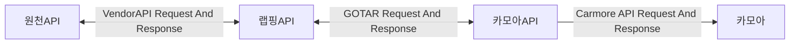

# Global OTA RequestAndResponse (GOTAR)
> 글로벌 OTA 렌터카 API들에 대한 통합 규격을 정의 하는 Repository

## APIs
> 글로벌 OTA 렌터카 API들에 대한 DTO Interface

  - `${API Name}`Request
    - `${API Name}`의 요청 값에 대한 정의

  - `${API Name}`Response
    - `${API Name}`의 응답 값에 대한 정의

## Interfaces
> 글로벌 OTA 렌터카 API에 사용되는 Interface

- `Required`: 아래 정의 되는 `Interface`의 각 `Key`는 모두 필수 값 입니다.
  - 작업하는 API에서 Key에대한 Value 값을 정의할 수 없다면 아래 기본값을 사용해야 합니다. __(Nullable인경우 Null)__
  - 주석 내용 중 __`@required`: true__ 인 경우 기본값을 넣을 수 없는 `Key`입니다.
  - 기본 값을 할당할 수 없는 `Key`는 기본 값을 상수로 만들어 할당 해야 합니다.
    - `String` : null or ''
    - `Number` : null or 0
    - `Boolean` : false
    - `Array` : [] (Empty Array)

### Comment Component
  - `@type`
    - String, Boolean등 Component들의 타입
  - `@description`
    - Component에대한 설명
  - `@nullable`
    - Null허용 여부
  - `@required`
    - Interface에서 기본값 이 불가능 한 필수적 으로 정의해야 하는 값인지 에대한 여부
  - `@example`
    - Component 예시값 (실제 값과 최대한 비슷 하게), 열거 가능한 값인 경우 열거 가능한 값을 전부 작성.
  - `@default`
    - Component 기본값, 불가능 한 경우 `N/A`

### Interface
  - [`Car`](Car.ts)
    - 차종에 대한 정의 (실제 판매 되는 렌터카에 대한 `차종` EX: `K5`등)
    - 운영에 사용되는 캐싱된 차종

  - [`Vehicle`](Vehicle.ts)
    - 차량에 대한 정의 (실제 판매 되는 렌터카 상품)

  - [`Affiliate`](Affiliate.ts)
    - 업체에 대한 정의 (운영에 사용되는 캐싱된 업체)

  - [`Vendor`](Vendor.ts)
    - `Budget`, `Avis`와 같은 업체 브랜드

  - [`Shop`](Shop.ts)
    - `Budget LA공항점`과 같은 업체의 지점

  - [`Order`](Order.ts)
    - `Vehicle`에대한 실제 주문 내용

  - [`Reservation`](Reservation.ts)
    - `Carmore` 운영에 사용 되는 예약에 대한 `Interface`

### APIs
> Global API에서 필수적 으로 제공 해야 하는 API

  - `APIs Name`
    - `APIs Description`
    - `API Name`
      - `Request` : 해당 API의 Request Query, Param, Body를 포함한 Typescript File
      - `Response` : 해당 API의 Response를 Typescript File
      - endPoint : 해당 API의 EndPoint 및  Http Method

  - `Vehicle`
    - `차량 목록`, `차량 상세`를 제공 해야 한다.
      - `차량 목록`
        - [Request](./APIs/DTO/Request/VehicleListRequest.ts)
        - [Response](./APIs/DTO/Response/VehicleListResponse.ts)
        - endPoint : `GET` `/vehicles`
      - `차량 상세`
        - [Request](./APIs/DTO/Request/VehicleDetailRequest.ts)
        - [Response](./APIs/DTO/Response/VehicleDetailResponse.ts)
        - endPoint : `GET` `/vehicles/:id`
  - `Order`
    - `예약 생성`, `예약 상세`, `예약 취소`를 제공 해야 한다.
      - `예약 생성`
        - [Request](./APIs/DTO/Request/OrderCreateRequest.ts)
        - [Response](./APIs/DTO/Response/OrderCreateResponse.ts)
        - endPoint : `POST` `/orders`
      - `예약 상세`
        - [Request](./APIs/DTO/Request/OrderDetailRequest.ts)
        - [Response](./APIs/DTO/Response/OrderDetailResponse.ts)
        - endPoint : `GET` `/orders/:id`
      - `예약 취소`
        - [Request](./APIs/DTO/Request/OrderCancelRequest.ts)
        - [Response](./APIs/DTO/Response/OrderCancelResponse.ts)
        - endPoint : `PATCH` `/orders/:id/cancelation`
  - `Affiliates`
    - `캐싱 업체 목록 조회`, `캐싱 업체 단일 조회`를 제공 해야 한다.
      - `업체 목록 조회`
        - [Request](./APIs/DTO/Request/GetAffiliatesRequest.ts)
        - [Response](./APIs/DTO/Response/GetAffiliatesResponse.ts)
        - endPoint : `GET` `/affiliates/`
      - `업체 단일 조회`
        - [Request](./APIs/DTO/Request/GetAffiliateRequest.ts)
        - [Response](./APIs/DTO/Response/GetAffiliateResponse.ts)
        - endPoint : `GET` `/affiliates/:id`
  - `Cars`
    - `캐싱 차종 목록 조회`, `캐싱 차종 단일 조회`를 제공 해야 한다.
      - `차종 목록 조회`
        - [Request](./APIs/DTO/Request/GetCarsRequest.ts)
        - [Response](./APIs/DTO/Response/GetCarsResponse.ts)
        - endPoint : `GET` `/cars/`
      - `차종 단일 조회`
        - [Request](./APIs/DTO/Request/GetCarRequest.ts)
        - [Response](./APIs/DTO/Response/GetCarResponse.ts)
        - endPoint : `GET` `/cars/:id`  
  - `Reservations`
    - `예약 목록에대한 정보를 제공 해야한다`
      - `예약 목록 조회`
        - [Request](./APIs/DTO/Request/GetReservationsRequest.ts)
        - [Response](./APIs/DTO/Response/GetReservationsResponse.ts)
        - endPoint : `GET` `/reservations/` 

## Flow



## 비동기 방식 예약

- 카모아API Server에서 가예약이 완료 되면 대상 글로벌API로 예약 요청을 전송한다.
    - 이때 받은 예약에대한 요청 값은 기존 동기방식 (Order CreateOrder)와 동일하다.
  
- 글로벌API는 예약요청에대한 값이 유효하다면 예약 요청 성공응답을 보내야 한다.
    - 이때 보내는 응답값은 기존 CreateOrder 응답값이 아닌 위 비동기 예약 요청 성공 응답값을 보내야한다.
      - 성공,실패 상관없이 예약에대한 프로세스가 추적이 가능한 특정 Key를 반환해야한다. (CommonResponse의 trackingId와 같은 값.)
      - 성공 시 (200 OK), 실패 시 (실패 오류 + 오류 메시지)
      - 예: 성공 시 200 OK + trackingId, 실패 시 500 Internal Server Error + Error Message + trackingId
  
- 글로벌API는 실패,성공과 상관 없이 카모아API Server의 예약승인 API로 아래 예시와 같은 요청 값을 보내야한다.
    - 요청값은 기존 CreateOrderRequest에 `withOutPayment` 신규 키가 추가된 형태이다.
    - 예약 승인 API
      - 실제 서버 : `[POST]` https://common-api.carmore.kr/global/reservations/approval
      - 개발 서버 : `[POST]` https://dev-common-api.carmore.kr/global/reservations/approval
    - 하기 예시는 위 요청으로 보내야할 요청 `Body`에대한 예시 값 입니다.
```
요청값 예시
  예약 성공시
  isSuccess: true
  reservationNumber: KL123123
  globalApiOrderId: 'AOB12COX'
  confirmationId: 'AOB12COX',
  isConfirmed: true,
  confirmInHours: 0,
  orderCreateTrackingId: UUID,
  withOutPayment: false,
  
예약 실패시
  isSuccess: false
  reservationNumber: KL123123
  globalApiOrderId: ''
  confirmationId: '',
  isConfirmed: false,
  confirmInHours: 0,
  orderCreateTrackingId: UUID,
  withOutPayment: false,
```
